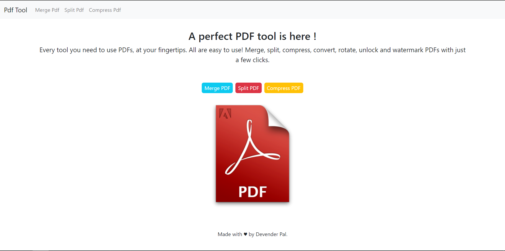

# Perfect-Pdf-Tool

## This project is made in Python Django along with basic HTML and CSS. 

This project is aimed to provide a free pdf tool which can be very useful whenever you need a quick work on pdf like merging two or more pdfs, or it can be like compressing the size of the pdf and so on.

